

  <a href="https://goneidle.com">
    <video src="https://raw.githubusercontent.com/EthanY33/EthanY33/chore/profile-overhaul/assets/hero.mp4"
           width="900" muted autoplay loop playsinline>
      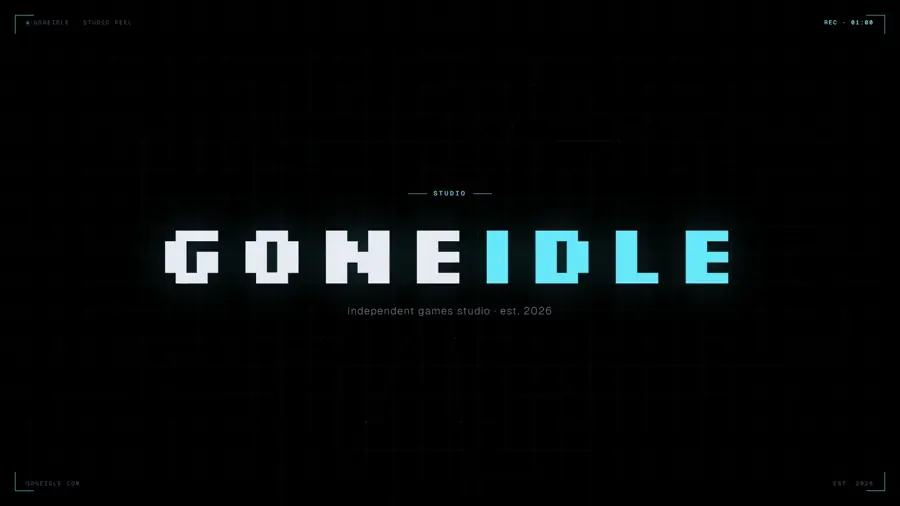
    </video>
  </a>

<h1 align="center">Ethan Yucetepe</h1>

  CS @ NJIT, graduating <b>December 2026</b>. I build systems: Go WebSocket infrastructure, 
  Claude Code tooling, and full-stack web apps. On the side I run
  <a href="https://goneidle.com"><b>goneIdle</b></a>, a one-person game studio, and ship products on Steam. 
  Go · TypeScript · Python · React / Next.js · C# / Godot · WebSockets · Canvas 2D

  <a href="https://goneidle.com">goneidle.com</a>
  &nbsp;·&nbsp;
  <a href="mailto:ethanyucetepe@gmail.com">ethanyucetepe@gmail.com</a>
  &nbsp;·&nbsp;
  <a href="https://www.linkedin.com/in/ethanyucetepe/">LinkedIn</a>

  Open to <b>SWE roles, new-grad, December 2026 cycle</b>. Best reached at the email above.

  

### Engineering

<table>
<tr>
<td width="50%" valign="top">
  

**[wirefan](https://github.com/EthanY33/wirefan)** &nbsp;Go · WebSockets 
Single-binary WebSocket fanout server. Channel pub/sub, HMAC-bound subscribe tokens, zero runtime dependencies, and a goroutine-leak invariant proven under 1000-connection churn.

</td>
<td width="50%" valign="top">
  <a href="https://github.com/EthanY33/jobcopilot">
    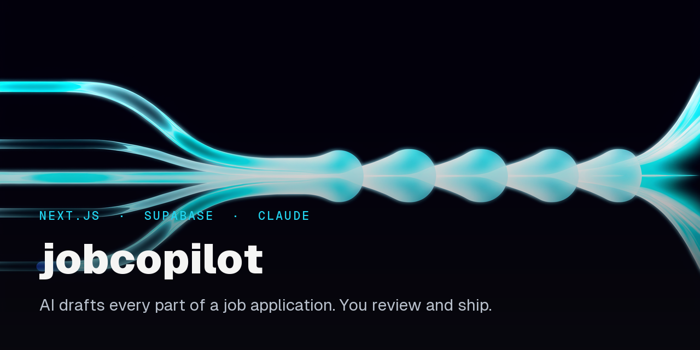
  </a>

**[jobcopilot](https://github.com/EthanY33/jobcopilot)** &nbsp;Next.js · Supabase · Claude API 
Full-stack job-application copilot. The Claude API drafts every part of an application; you review and ship. 7-stage kanban tracker, resume-variant generator, OAuth.

</td>
</tr>
</table>

<table>
<tr>
<td width="50%" valign="top">
  

**[atelier](https://github.com/EthanY33/atelier)** &nbsp;JS · Claude Agent SDK 
Claude Code plugin. Seven composable skills on a shared brand source of truth. Dogfooded daily; every page of goneidle.com shipped through it.

</td>
<td width="50%" valign="top">
  <a href="https://github.com/EthanY33/news-bias-analyzer">
    
  </a>

**[news-bias-analyzer](https://github.com/EthanY33/news-bias-analyzer)** &nbsp;Python · Gemini 
CLI that compares how multiple outlets frame the same story, with sentiment and framing analysis across sources.

</td>
</tr>
<tr>
<td width="50%" valign="top">
  

**[PrivacyPulse](https://github.com/EthanY33/PrivacyPulse)** &nbsp;Chrome extension 
Intercepts cookie consent banners and surfaces what you are actually agreeing to before you click Accept All.

</td>
<td width="50%" valign="top">
  <a href="https://github.com/EthanY33/trailer-tripwire">
    
  </a>

**Pre-ship pattern checkers** &nbsp;JS · CLI 
[trailer-tripwire](https://github.com/EthanY33/trailer-tripwire) (video), [copy-tripwire](https://github.com/EthanY33/copy-tripwire) (text), [screenshot-tripwire](https://github.com/EthanY33/screenshot-tripwire) (images). Catch measurable AI-default tells before reviewers do.

</td>
</tr>
</table>

  

### Shipped

I run **[goneIdle](https://goneidle.com)**, a one-person game studio. I take products from prototype to a paid Steam listing on my own: engine, economy, audio, store, and site.

  <a href="https://goneidle.com">
    <video src="https://raw.githubusercontent.com/EthanY33/EthanY33/chore/profile-overhaul/assets/one-semester-left.mp4"
           width="900" muted autoplay loop playsinline>
      
    </video>
  </a>

<table>
<tr>
<td width="55%">
  <a href="https://goneidle.com/tidewane">
    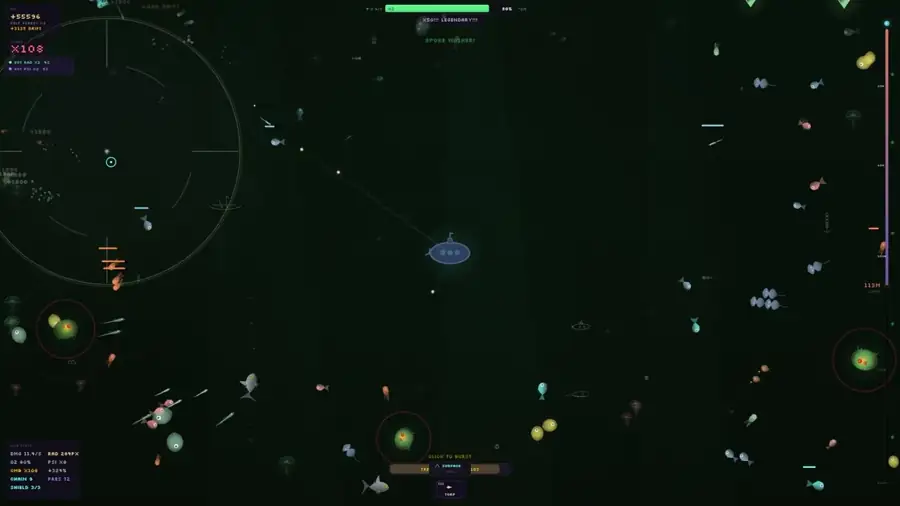
  </a>
</td>
<td width="45%" valign="middle">

**[TideWane](https://goneidle.com/tidewane)** &nbsp;`v1.2.3`

Deep-sea idle dungeon crawler. Live on Steam (Windows, Linux, macOS).

3-layer prestige economy, 25-boss progression, Canvas 2D game loop, procedural Web Audio synthesis, native IPC bridge to a Godot WebView host, Steam achievements and cloud saves.

<a href="https://goneidle.com/tidewane">
  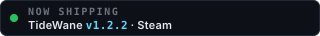
</a>

</td>
</tr>
</table>

  <a href="https://goneidle.com/tidewane">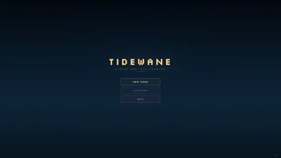</a>
  <a href="https://goneidle.com/tidewane">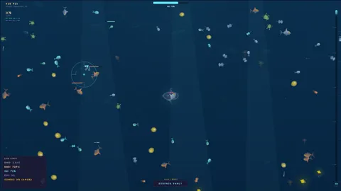</a>
  <a href="https://goneidle.com/tidewane">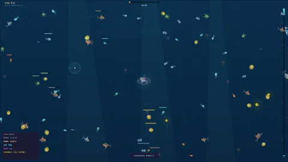</a>
  <a href="https://goneidle.com/tidewane">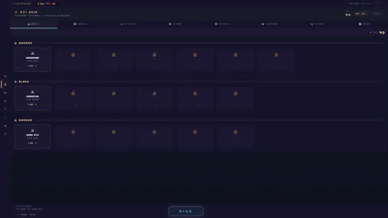</a>
  <a href="https://goneidle.com/tidewane">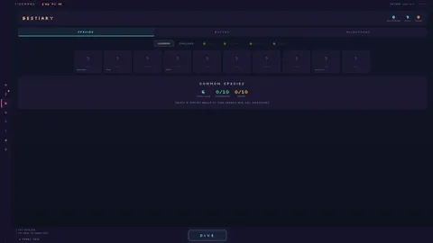</a>

  

  Building at <a href="https://goneidle.com">goneidle.com</a>. Open to SWE roles for the December 2026 new-grad cycle.

